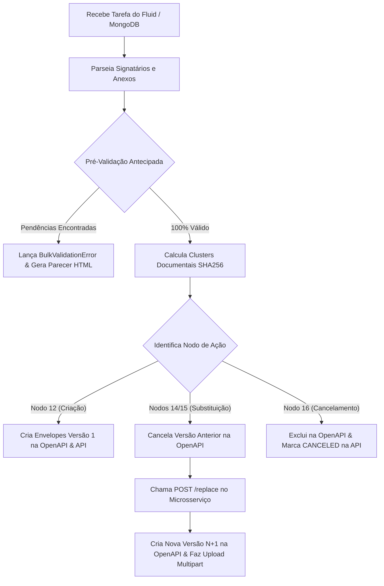

# 🤖 Guia Definitivo de Configuração e Operação — Automação RPA (DocJourney)

> **Ambiente Corporativo:** Sicredi — Esteira de Assinatura Digital  
> **Tecnologias:** Python 3.10+, HTTPX, Loguru, Pydantic v2, Windows RPA Desktop/VM  
> **Versão:** 2.0.0

---

## 📋 Sumário
1. [Visão Geral e Arquitetura Desacoplada](#1-visão-geral-e-arquitetura-desacoplada)
2. [Ciclo Decisório & Nodos da Automação](#2-ciclo-decisório--nodos-da-automação)
3. [Requisitos do Sistema & Pré-Requisitos](#3-requisitos-do-sistema--pré-requisitos)
4. [Passo a Passo de Instalação no Windows](#4-passo-a-passo-de-instalação-no-windows)
5. [Configuração de Variáveis de Ambiente (.env)](#5-configuração-de-variáveis-de-ambiente-env)
6. [Sistema de Logs Detalhados com Loguru](#6-sistema-de-logs-detalhados-com-loguru)
7. [Integração Desacoplada com o Microsserviço](#7-integração-desacoplada-com-o-microsserviço)
8. [Integração com a OpenAPI Sicredi (Assinaturas Digitais)](#8-integração-com-a-openapi-sicredi-assinaturas-digitais)
9. [Como Executar e Simular Tarefas do Robô](#9-como-executar-e-simular-tarefas-do-robô)
10. [Pré-Validação Antecipada & Parecer HTML para o Fluid](#10-pré-validação-antecipada--parecer-html-para-o-fluid)
11. [Troubleshooting & Resolução de Problemas no Windows Corporativo](#11-troubleshooting--resolução-de-problemas-no-windows-corporativo)

---

## 1. Visão Geral e Arquitetura Desacoplada

O módulo de **Automação RPA** é o orquestrador robótico responsável por processar as tarefas de formalização de crédito e produtos vindas do **MongoDB / esteira Fluid (Sicredi)**.

### Princípios Arquiteturais Obrigatórios:
- **100% Desacoplada de Bancos Relacionais (Zero SQL):** O robô **não** executa `SELECT`, `INSERT`, `UPDATE` nem importa módulos de banco de dados diretamente. Toda persistência, histórico e governança são consumidos via requisições HTTP RESTful contra o **Microsserviço DocJourney**.
- **Resiliência com Fallback em Memória:** Se o microsserviço estiver temporariamente offline, o client HTTP (`MicroserviceApiClient`) chaveia automaticamente para **Mock em memória**, garantindo que testes e validações locais não travem a operação.
- **Pré-Validação Antecipada (*No-Fail-Fast*):** Não interrompe no primeiro erro encontrado. Varre simultaneamente todos os signatários, CPFs, e-mails, telefones, integridade e limites de tamanho dos arquivos anexos, gerando um **parecer HTML completo** para o operador corrigir tudo de uma só vez na esteira Fluid.
- **Clusterização Documental por Hash SHA256:** Agrupa participantes pela interseção exata dos documentos que lhes cabe assinar. Garante que ninguém receba para assinar documentos que não sejam de sua alçada.
- **Substituição Seletiva e Versionamento:** Quando um documento é alterado ou um signatário é corrigido após parecer, o robô cancela graciosamente o envelope obsoleto na OpenAPI e gera uma versão incremental ($v_{nova} = v_{antiga} + 1$) auditada pelo microsserviço.

```
    ┌───────────────────────────────┐
    │     MongoDB / Esteira Fluid   │
    │   (Tarefas 10410 / 12905)     │
    └──────────────┬────────────────┘
                   │
                   ▼
    ┌───────────────────────────────┐
    │      Automação RPA (Windows)  │
    │                               │
    │ 1. Parseamento de Payload     │
    │ 2. Pré-Validação Antecipada   │
    │ 3. Clusterização SHA256       │
    │ 4. Logs Ricos via Loguru      │
    └──────┬─────────────────┬──────┘
           │                 │
           │ HTTP REST       │ HTTP REST & Multipart
           ▼                 ▼
┌────────────────────┐   ┌──────────────────────────────┐
│  Microsserviço     │   │ OpenAPI v2 Sicredi/Certisign │
│  DocJourney        │   │ (Criação, Upload e Assinatura│
│  (Persistência e   │   └──────────────────────────────┘
│   Auditoria)       │
└────────────────────┘
```

---

## 2. Ciclo Decisório & Nodos da Automação

A automação executa dinamicamente o fluxo adequado de acordo com a ação solicitada pela esteira Fluid:

| Nodo | Ação | Descrição da Operação |
| :---: | :--- | :--- |
| **12** | `CREATE_ENVELOPE` | Fluxo padrão de primeira criação. Executa validação, clusterização, cria a jornada na API e envia os envelopes à OpenAPI (Versão 1). |
| **13** | `UPDATE_SIGNATURE_METHOD` | Alteração de canal ou método de assinatura (ex: troca de E-mail para WhatsApp ou Eletrônica para Digital) sem recriar o envelope. |
| **14** | `CHANGE_SIGNERS` | Substituição Seletiva por retificação de participantes: cancela o envelope ativo na OpenAPI, aciona `/replace` no microsserviço e gera a Versão N+1. |
| **15** | `CHANGE_DOCUMENTS` | Substituição Seletiva por troca de minuta PDF: cancela o envelope anterior, aciona `/replace` na API e sobe novos binários (Versão N+1). |
| **16** | `CANCEL_ENVELOPE` | Cancelamento explícito: remove o envelope na OpenAPI e registra a justificativa em `maintenance_history` no microsserviço. |



---

## 3. Requisitos do Sistema & Pré-Requisitos

| Requisito | Versão Recomendada | Observações |
| :--- | :--- | :--- |
| **Sistema Operacional** | Windows 10/11 ou Windows Server | Ambiente corporativo padrão de robôs RPA |
| **Python** | 3.10 ou superior (Recomendado: 3.12) | Adicionado às variáveis de ambiente (PATH) |
| **Rede Interna** | Acesso HTTP/HTTPS liberado | Acesso à API do Microsserviço e à OpenAPI Sicredi |
| **PowerShell** | 5.1 ou PowerShell 7 | Console recomendado para execução e testes |
| **Encoding de Console** | UTF-8 (`chcp 65001`) | Para evitar problemas de acentuação |

---

## 4. Passo a Passo de Instalação no Windows

Siga os passos a seguir no computador ou máquina virtual onde o robô irá operar:

### Passo 1: Abrir o PowerShell como Administrador ou Usuário Comum
Navegue até a pasta raiz do projeto:
```powershell
cd "c:\Users\<seu_usuario>\...\prod_docjourney"
```

### Passo 2: Liberar Execução de Scripts no PowerShell
Se o PowerShell bloquear a execução de scripts locais:
```powershell
Set-ExecutionPolicy -Scope Process -ExecutionPolicy Bypass
```

### Passo 3: Configurar o Encoding do Terminal para UTF-8
Evita que caracteres acentuados ou símbolos do robô causem erros `UnicodeEncodeError`:
```powershell
chcp 65001
```

### Passo 4: Criar o Ambiente Virtual (`.venv`)
```powershell
python -m venv .venv
```

### Passo 5: Ativar o Ambiente Virtual
```powershell
.\.venv\Scripts\Activate.ps1
```
*(O prompt exibirá o prefixo `(.venv)` indicando que o ambiente está ativo).*

### Passo 6: Instalar as Dependências da Automação
```powershell
pip install -r automacao/requirements.txt
```

> [!TIP]
> **Em caso de restrições de proxy / certificado corporativo Sicredi:**
> ```powershell
> pip install --trusted-host pypi.org --trusted-host files.pythonhosted.org -r automacao/requirements.txt
> ```

---

## 5. Configuração de Variáveis de Ambiente (.env)

Crie um arquivo `.env` dentro da pasta `automacao/` ou na raiz do projeto.

### Catálogo de Variáveis da Automação:

| Variável | Padrão | Descrição |
| :--- | :--- | :--- |
| `MICROSERVICE_BASE_URL` | `http://localhost:8000` | URL da API REST do Microsserviço DocJourney. |
| `OPENAPI_BASE_URL` | `https://api-mock.sicredi.local/...` | URL da OpenAPI v2 da Plataforma de Assinatura. |
| `OPENAPI_CLIENT_ID` | `mock_client_id` | Identificador de aplicação para autenticação na OpenAPI. |
| `OPENAPI_ACCESS_TOKEN` | `mock_access_token` | Token Bearer ou credencial de acesso à OpenAPI. |
| `MAX_DOCUMENT_SIZE_MB` | `20.0` | Limite máximo permitido por arquivo PDF individual (em Megabytes). |
| `MAX_ENVELOPE_SIZE_MB` | `200.0` | Limite máximo consolidado da soma de todos os anexos de um envelope. |
| `LOG_LEVEL` | `INFO` | Nível de detalhamento do Loguru (`DEBUG`, `INFO`, `WARNING`, `ERROR`). |
| `LOG_DIR` | `logs` | Diretório onde os arquivos de log rotativos são salvos. |

---

### Perfil 1: Ambiente de Testes / Simulação Local (Zero Dependências Externas)
Ideal para homologar regras de negócio e testar sem conexão de rede:
```env
# automacao/.env (Modo Simulação Offline)
MICROSERVICE_BASE_URL=http://localhost:8000
OPENAPI_BASE_URL=https://api-mock.sicredi.local/assinatura-open-api
OPENAPI_CLIENT_ID=mock_client_id
OPENAPI_ACCESS_TOKEN=mock_access_token

# Limites Documentais
MAX_DOCUMENT_SIZE_MB=20.0
MAX_ENVELOPE_SIZE_MB=200.0

# Logs em modo detalhado
LOG_LEVEL=DEBUG
LOG_DIR=logs
```

---

### Perfil 2: Ambiente Corporativo de Produção / Homologação
```env
# automacao/.env (Ambiente Integrado Sicredi)
MICROSERVICE_BASE_URL=http://servidor-microservico.sicredi.local:8000
OPENAPI_BASE_URL=https://api-assinatura.sicredi.com.br/v2
OPENAPI_CLIENT_ID=app_rpa_docjourney
OPENAPI_ACCESS_TOKEN=eyJhbGciOiJSUzI1NiIsInR5cCI6IkpXVCJ9...

# Limites Documentais
MAX_DOCUMENT_SIZE_MB=20.0
MAX_ENVELOPE_SIZE_MB=200.0

# Logs de Produção
LOG_LEVEL=INFO
LOG_DIR=logs
```

---

## 6. Sistema de Logs Detalhados com Loguru

A automação utiliza a biblioteca **Loguru** para prover visibilidade cirúrgica de cada etapa do processamento do robô.

### Localização dos Arquivos de Log:
```
prod_docjourney/
└── logs/
    ├── automacao_2026-10-05.log   <-- Log de execução operacional diário
    └── automacao_errors.log       <-- Log exclusivo de falhas e pendências
```

### O que o Loguru Registra Passo a Passo:
1. **Início da Tarefa:**
   ```
   2026-10-05 07:10:22.912 | INFO | DocJourneyAutomation | automacao.controllers.orchestrator_ctr:_handle_cluster_workflow:272 - Iniciando processamento da tarefa #200001 (Nodo: 12) | mongo_id: scen1_mongo_id_001
   ```
2. **Parseamento e Estatísticas de Payload:**
   ```
   2026-10-05 07:10:22.912 | INFO | DocJourneyAutomation | automacao.controllers.orchestrator_ctr:_handle_cluster_workflow:274 - Payload parseado: 2 signatário(s), 3 anexo(s).
   ```
3. **Pré-Validação Antecipada:**
   - Se aprovado:
     ```
     2026-10-05 07:10:22.913 | INFO | DocJourneyAutomation | automacao.controllers.orchestrator_ctr:_handle_cluster_workflow:280 - Pré-validação antecipada concluída com SUCESSO (nenhum erro impeditivo).
     ```
   - Se reprovado com pendências:
     ```
     2026-10-05 07:10:27.161 | WARNING | DocJourneyAutomation | automacao.controllers.orchestrator_ctr:_handle_cluster_workflow:282 - Pré-validação REPROVADA para tarefa #778899: 1 pendência(s) detectada(s).
     2026-10-05 07:10:27.162 | ERROR   | DocJourneyAutomation | automacao.main:run_automation_task:53 - --> [ERRO DE FLUXO MAPEADO: CORRUPTED_DOCUMENT_ERROR] <--
     ```
4. **Cálculo de Hash e Clusterização SHA256:**
   ```
   2026-10-05 07:10:22.913 | INFO | DocJourneyAutomation | automacao.controllers.orchestrator_ctr:_handle_cluster_workflow:315 - Clusterização documental SHA256: 1 cluster(s) de envelopes gerado(s).
   ```
5. **Comunicação com a API do Microsserviço:**
   ```
   2026-10-05 07:10:27.016 | INFO | DocJourneyAutomation | automacao.controllers.orchestrator_ctr:_handle_cluster_workflow:325 - Jornada persistida na API REST: ID 3cbd7abc-8258-446a-aa7f-b160113ea9b0 (mongo_id: scen1_mongo_id_001)
   ```
6. **Diagnóstico Rápido de Erros:**
   Exceções contam com `backtrace=True` e `diagnose=True`, mostrando o conteúdo exato das variáveis no instante da falha sem necessidade de rodar debugger.

---

## 7. Integração Desacoplada com o Microsserviço

A comunicação entre a automação e o microsserviço é gerenciada pela classe `MicroserviceApiClient`:

- **Zero SQL:** O robô não precisa de credenciais de banco de dados (`postgres`), nem de portas de banco abertas no firewall.
- **Chamadas REST:**
  - `POST /api/v1/journeys`: Criação/recuperação da jornada pelo `mongo_id`.
  - `GET /api/v1/journeys/{id}/envelopes`: Busca dos envelopes ativos para decidir criação vs substituição.
  - `POST /api/v1/envelopes`: Registro do novo envelope gerado.
  - `POST /api/v1/envelopes/{id}/replace`: Substituição seletiva auditada.
  - `POST /api/v1/maintenance/cancel`: Cancelamento administrativo com justificativa.
- **Modo Offline Transparente:** Caso o servidor do microsserviço não responda (`WinError 10061` ou timeout), o client emite um log informativo via Loguru e ativa a camada em memória para que os testes e rotinas de validação continuem funcionando sem falhas críticas.

---

## 8. Integração com a OpenAPI Sicredi (Assinaturas Digitais)

A classe `OpenApiV2Client` encapsula todas as integrações com a plataforma de assinatura digital:

1. **Criação do Envelope (`POST /v2/envelope/create`):**
   Submete o título, descrição, lista de signatários com seus papéis e métodos de autenticação.
2. **Upload Multipart de PDFs (`POST /files/envelope/{id}/files`):**
   Envia os arquivos binários acompanhados pelo cabeçalho `documentTypes`:
   ```json
   [
     {
       "fileName": "765 - CCB.pdf",
       "documentType": [
         {"documentType": "DOCUMENT_TYPE_TTD_765", "isAttachment": false}
       ]
     }
   ]
   ```
3. **Resiliência e Retries:** Em caso de oscilação momentânea de rede externa, o cliente realiza retries com backoff exponencial antes de desistir.

---

## 9. Como Executar e Simular Tarefas do Robô

### A. Executar a Suíte de Cenários de Negócio Interativos
Testa os 6 fluxos reais da esteira ponta a ponta (Criação, Substituição de PDF, Documento Corrompido, Cancelamento):
```powershell
# Com a .venv ativada:
python automacao/tests/test_interactive_scenarios.py
```
*(Você verá os logs coloridos do Loguru demonstrando cada decisão do robô).*

### B. Executar os Testes Unitários com Pytest
```powershell
python -m pytest automacao/tests/
```

### C. Como Chamar o Robô em Código Python
```python
from automacao.main import run_automation_task

# Payload extraído do MongoDB / Fluid
tarefa_fluid = {
    "_id": "64f1a2b3c4d5e6f7a8b9c0d1",
    "num_processo": 10410,
    "nome_processo": "Abertura de Conta Corrente",
    "nodo": 12,
    "anexos": [
        {
            "nome": "765 - CCB.pdf",
            "hash": "a1b2c3d4e5f6...",
            "tipo_doc_id": 765,
            "extensao": "pdf",
            "conteudo_binario": b"%PDF-1.4..."
        }
    ],
    "signatarios": [
        {
            "tax_id": "11158072937",
            "name": "Pedro Henrique Lopes",
            "role": "Titular",
            "email": "pedro_hlopes@sicredi.com.br",
            "phone": "42999843189",
            "signature_type": "ELETRONIC",
            "validation_channel": "WHATSAPP",
            "document_ids": ["765 - CCB.pdf"]
        }
    ]
}

# Execução
resultado = run_automation_task(tarefa_fluid)
print(resultado)
```

---

## 10. Pré-Validação Antecipada & Parecer HTML para o Fluid

Se a solicitação recebida da esteira contiver qualquer irregularidade, o robô interrompe o avanço e **gera automaticamente um parecer estruturado em HTML** para ser colado no histórico da tarefa no Fluid:

### O Que é Validado Antes de Chamar a API Externa:
- **CPFs e CNPJs:** Validação de dígitos verificadores e formato.
- **Canais de Notificação:** E-mail válido e celular com DDD correto para WhatsApp/SMS.
- **Integridade de Documentos:**
  - Arquivos vazios (0 bytes).
  - Arquivos com tamanho superior a `MAX_DOCUMENT_SIZE_MB` (padrão: 20 MB).
  - Envelopes consolidados com tamanho superior a `MAX_ENVELOPE_SIZE_MB` (padrão: 200 MB).
  - Documentos corrompidos ou ilegíveis marcados pela esteira.

### Exemplo do Parecer HTML Gerado pelo Robô:
```html
<div style="font-family: Arial, sans-serif; color: #333;">
  <h3 style="color: #c0392b;">🚨 Pendências Identificadas na Solicitação de Assinatura</h3>
  <p>Foram encontradas as seguintes não-conformidades impeditivas:</p>
  <ul>
    <li><b>Signatário 1 (João da Silva):</b> CPF '12345678900' inválido.</li>
    <li><b>Signatário 2 (Maria Souza):</b> Telefone '429999' incompleto para validação via WhatsApp.</li>
    <li><b>Anexo 'Contrato.pdf':</b> Arquivo corrompido ou vazio (0 bytes).</li>
  </ul>
  <p><i>Por favor, saneie os dados cadastrais e reencaminhe a tarefa no Fluid.</i></p>
</div>
```

---

## 11. Troubleshooting & Resolução de Problemas no Windows Corporativo

### 1. `File ... cannot be loaded because running scripts is disabled on this system`
- **Causa:** Política de execução restritiva do PowerShell no Windows.
- **Solução:**
  ```powershell
  Set-ExecutionPolicy -Scope Process -ExecutionPolicy Bypass
  ```

### 2. Caracteres estranhos ou `UnicodeEncodeError: 'charmap' codec can't encode character`
- **Causa:** Terminal do Windows utilizando tabela de caracteres antiga (`cp1252`).
- **Solução:**
  Execute no PowerShell antes de rodar os scripts:
  ```powershell
  chcp 65001
  ```
  *(A automação também aplica `sys.stdout.reconfigure(encoding="utf-8")` internamente por segurança).*

### 3. Falha de Conexão com o Microsserviço (`WinError 10061`)
- **Causa:** O microsserviço na porta `8000` não está em execução.
- **Comportamento:** O robô não quebra; ele ativa o modo Mock em memória e exibe aviso no loguru. Para usar a API real, certifique-se de iniciar o microsserviço em outro terminal:
  ```powershell
  python -m uvicorn microservico.main:app --port 8000
  ```

### 4. Erros de Proxy Corporativo na Chamada da OpenAPI Externa
- **Causa:** A rede do Sicredi exige configuração explícita de proxy para saída de internet.
- **Solução:**
  Defina as variáveis de ambiente antes de executar:
  ```powershell
  $env:HTTP_PROXY = "http://proxy.sicredi.net:8080"
  $env:HTTPS_PROXY = "http://proxy.sicredi.net:8080"
  $env:NO_PROXY = "localhost,127.0.0.1,sicredi.local"
  ```
