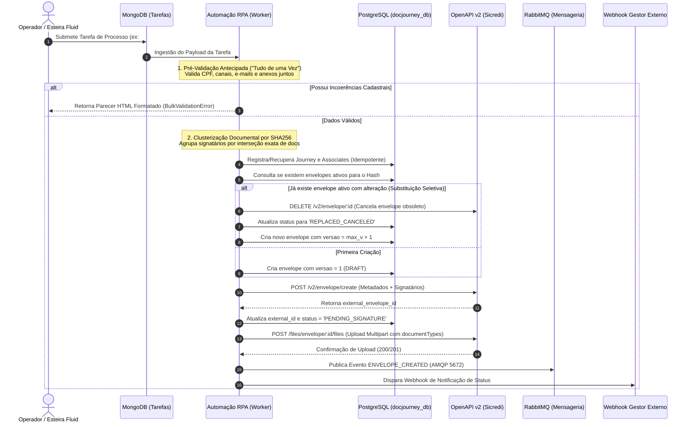
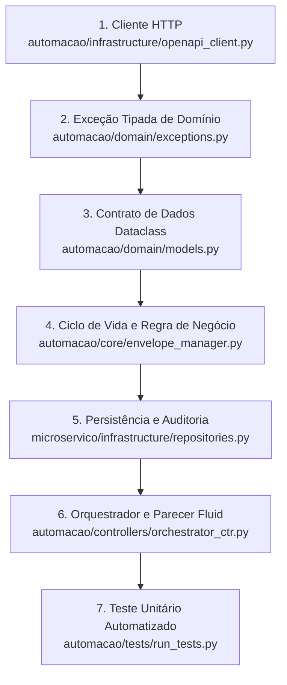

# Manual Mestre de Arquitetura, Integração e Alta Disponibilidade (PROD_guia_mestre_passo_a_passo.md)

**Documento Técnico Oficial de Engenharia, Integração e Operação (PRODUÇÃO)**  
**Projeto:** DocJourney - Orquestrador de Assinaturas Eletrônicas e Gestão Documental  
**Módulos Integrados:** Microsserviço Backend (`microservico/`) & Automação RPA (`automacao/`)  
**Data da Versão:** 2026-09-07  
**Status:** Homologado para Produção

---

## 📑 Sumário Executivo
1. [Visão Geral e Fluxo Ponta a Ponta](#1-visão-geral-e-fluxo-ponta-a-ponta)
2. [Detalhamento de Requisições HTTP (Cada POST e Chamada)](#2-detalhamento-de-requisições-http-cada-post-e-chamada)
3. [Guia de Migração: Dados de Teste (Mock) para Dados Reais de Produção](#3-guia-de-migração-dados-de-teste-mock-para-dados-reais-de-produção)
4. [Como Adicionar Novas Tratativas e Regras de Negócio](#4-como-adicionar-novas-tratativas-e-regras-de-negócio)
5. [Arquitetura de Alta Disponibilidade, Resiliência e Servidor de Backup](#5-arquitetura-de-alta-disponibilidade-resiliência-e-servidor-de-backup)
6. [Roteiro Prático de Operação e Comandos de Diagnóstico](#6-roteiro-prático-de-operação-e-comandos-de-diagnóstico)

---

## 1. Visão Geral e Fluxo Ponta a Ponta

O sistema DocJourney integra a esteira de processos (MongoDB / Fluid), a base relacional de governança (PostgreSQL), o broker de mensageria assíncrona (RabbitMQ) e a API de Assinaturas Eletrônicas Sicredi (OpenAPI v2).



---

## 2. Detalhamento de Requisições HTTP (Cada POST e Chamada)

Abaixo estão especificadas todas as requisições de rede realizadas pelo sistema, incluindo payloads, headers, parâmetros e status codes.

---

### A. Criação Estrutural do Envelope
- **Método:** `POST`
- **Endpoint:** `{{baseUrl}}/assinatura-open-api/v2/envelope/create`
- **Content-Type:** `application/json`
- **Módulo Responsável:** [`OpenApiV2Client.create_envelope`](file:///c:/Users/lopes/OneDrive/Área%20de%20Trabalho/Programação/Sicredi/docjourney/automacao/infrastructure/openapi_client.py)
- **Objetivo:** Inicializa o envelope no portal de assinaturas e cadastra os participantes, seus papéis, canais e fatores de autenticação. **Não trafega arquivos binários nesta rota.**

#### Payload JSON Enviado:
```json
{
  "coop": "0703",
  "agency": "11",
  "account": "1111111111",
  "title": "Processo #1225591 - Cluster 974d23ca",
  "comment": "Envio de Documentos da Solicitação #1225591",
  "tags": ["PROCESSO_1225591"],
  "provider": "CERTISIGN",
  "notificationEmails": ["notificacao@sicredi.com.br"],
  "allowSignatureOrder": false,
  "documentSignaturePattern": "PADES",
  "hasValueElectronicChannel": false,
  "signers": [
    {
      "cpf": "02631353900",
      "name": "EDILSON PAULO DE FRANCA",
      "email": "francaedilson78@gmail.com",
      "phone": "42988187402",
      "ddi": 55,
      "title": ["Titular"],
      "flowRole": "ASSINAR",
      "signatureType": "ELETRONIC",
      "secondAuthFactor": false,
      "authenticationMethods": [
        { "method": "EMAIL" }
      ]
    },
    {
      "cpf": "11158072937",
      "name": "PEDRO HENRIQUE LOPES",
      "email": "pedro_hlopes@sicredi.com.br",
      "phone": "42999843189",
      "ddi": 55,
      "title": ["Avalista / Cônjuge"],
      "flowRole": "ASSINAR",
      "signatureType": "ELETRONIC",
      "secondAuthFactor": true,
      "authenticationMethods": [
        { "method": "WHATSAPP" }
      ]
    }
  ]
}
```

#### Resposta Esperada da API (HTTP 200/201):
```json
{
  "id": "e9b21f3c-8e4a-4b91-a1b7-99123847fa11",
  "status": "EM_PREENCHIMENTO",
  "title": "Processo #1225591 - Cluster 974d23ca"
}
```

---

### B. Upload Binário Multipart de Documentos
- **Método:** `POST`
- **Endpoint:** `{{baseUrl}}/assinatura-open-api/files/envelope/:envelopeId/files`
- **Content-Type:** `multipart/form-data`
- **Módulo Responsável:** [`OpenApiV2Client.upload_envelope_files`](file:///c:/Users/lopes/OneDrive/Área%20de%20Trabalho/Programação/Sicredi/docjourney/automacao/infrastructure/openapi_client.py)
- **Objetivo:** Enviar os arquivos binários PDFs vinculando-os ao envelope criado e atribuindo o código técnico TTD reconhecido pela plataforma.

#### Estrutura do Multipart:
| Campo / Part | Tipo | Descrição |
| :--- | :--- | :--- |
| `documentTypes` | `text/plain` (JSON String) | Mapeamento de tipos técnicos para cada arquivo físico enviado. |
| `files` | `application/pdf` (Binary) | Binário do arquivo 1 (ex.: `765 - CCB.pdf`). |
| `files` | `application/pdf` (Binary) | Binário do arquivo 2 (ex.: `678 - CET.pdf`). |

#### Formato do JSON `documentTypes`:
```json
[
  {
    "fileName": "765 - CCB Cédula de Crédito Bancário.pdf",
    "documentType": [
      {
        "documentType": "DOCUMENT_TYPE_TTD_765",
        "isAttachment": false
      }
    ]
  },
  {
    "fileName": "678 - CET Custo Efetivo Total.pdf",
    "documentType": [
      {
        "documentType": "DOCUMENT_TYPE_TTD_678",
        "isAttachment": false
      }
    ]
  }
]
```

#### Tratamento de Erros da API:
- Se a API retornar **HTTP 500**, o corpo de resposta contém uma lista detalhada no campo `details`:
  ```json
  { "error": "DOCUMENT_VALIDATION_ERROR", "details": ["O documento 765 exige padrão PDF/A", "Nome do arquivo excede 100 caracteres"] }
  ```
  O sistema captura e levanta [`DocumentUploadError`](file:///c:/Users/lopes/OneDrive/Área%20de%20Trabalho/Programação/Sicredi/docjourney/automacao/domain/exceptions.py), gravando no histórico de manutenção.

---

### C. Cancelamento de Envelope Obsoleto (Substituição Seletiva)
- **Método:** `DELETE`
- **Endpoint:** `{{baseUrl}}/assinatura-open-api/v2/envelope/:envelopeId`
- **Módulo Responsável:** [`OpenApiV2Client.delete_envelope`](file:///c:/Users/lopes/OneDrive/Área%20de%20Trabalho/Programação/Sicredi/docjourney/automacao/infrastructure/openapi_client.py)
- **Objetivo:** Cancelar a versão anterior no portal externo para impedir que signatários assinem documentos obsoletos após uma retificação.
- **Resposta Esperada:** `HTTP 200` ou `HTTP 204 No Content`.

---

### D. Disparo de Webhook de Notificação Externa
- **Método:** `POST`
- **Endpoint:** `{{NOTIFIER_WEBHOOK_URL}}`
- **Content-Type:** `application/json`
- **Módulo Responsável:** [`ExternalStatusNotifierClient.notify_status_change`](file:///c:/Users/lopes/OneDrive/Área%20de%20Trabalho/Programação/Sicredi/docjourney/microservico/notifier/client.py)
- **Objetivo:** Informar outros microsserviços ou sistemas da esteira sobre a criação, conclusão ou expiração de envelopes.

#### Payload JSON Disparado:
```json
{
  "process_number": 1225591,
  "envelope_id": "e9b21f3c-8e4a-4b91-a1b7-99123847fa11",
  "envelope_status": "COMPLETED",
  "updated_at": "2026-09-07T15:23:04.123456",
  "fluid_process_id": 1225591,
  "tag": "DOCJOURNEY_ORCHESTRATOR",
  "signers": [
    {
      "tax_id": "02631353900",
      "name": "EDILSON PAULO DE FRANCA",
      "signature_status": "SIGNED",
      "signed_at": "2026-09-07T15:20:10"
    }
  ]
}
```

---

## 3. Guia de Migração: Dados de Teste (Mock) para Dados Reais de Produção

Atualmente, para garantir que o projeto seja 100% testável localmente sem depender de VPN ou credenciais produtivas mTLS, alguns valores utilizam mocks controlados. Quando você for plugar o ambiente produtivo real, siga o checklist abaixo:

### 3.1. Onde os dados estão e onde substituí-los

| Dado Atual (Teste) | Onde está localizado | Como substituir para Produção |
| :--- | :--- | :--- |
| **URL da OpenAPI (`https://mtls-api-coop...`)** | [`openapi_client.py`](file:///c:/Users/lopes/OneDrive/Área%20de%20Trabalho/Programação/Sicredi/docjourney/automacao/infrastructure/openapi_client.py) | Configurar via variável de ambiente `OPENAPI_BASE_URL` no [`.env`](file:///c:/Users/lopes/OneDrive/Área%20de%20Trabalho/Programação/Sicredi/docjourney/.env). |
| **Certificado mTLS (Chave + Cert)** | Atualmente mockado em requisições de teste | Passar `cert=("caminho/cert.pem", "caminho/key.pem")` no cliente `httpx.Client(cert=...)`. |
| **Cooperativa / Agência / Conta** | Hardcoded em [`envelope_manager.py`](file:///c:/Users/lopes/OneDrive/Área%20de%20Trabalho/Programação/Sicredi/docjourney/automacao/core/envelope_manager.py#L86-L88) (`coop: "0703"`, `agency: "11"`, `account: "1111111111"`) | Extrair dinamicamente dos atributos da tarefa do MongoDB (ex.: `atributos.get("cooperativa")`, `atributos.get("agencia")`, `atributos.get("conta")`). |
| **E-mails de Notificação** | `notificationEmails: ["notificacao@sicredi.com.br"]` | Extrair do cadastro da agência ou passar o e-mail do analista responsável pelo processo. |
| **Binários dos PDFs** | Mockado como `b"%PDF-1.4 Mock PDF Content"` em [`envelope_manager.py`](file:///c:/Users/lopes/OneDrive/Área%20de%20Trabalho/Programação/Sicredi/docjourney/automacao/core/envelope_manager.py#L116) | Ler o arquivo PDF real em disco (`with open(caminho, "rb") as f: bin_data = f.read()`) ou baixar do Storage/GridFS do Fluid pelo hash do anexo. |

### 3.2. Como o código se comporta ao receber o dado real
- O cliente [`OpenApiV2Client`](file:///c:/Users/lopes/OneDrive/Área%20de%20Trabalho/Programação/Sicredi/docjourney/automacao/infrastructure/openapi_client.py) já possui os blocos `try/except` com verificação de status code HTTP real (`200`, `201`, `204`).
- Assim que o endpoint real responder `200/201`, ele desliga automaticamente o fallback de mock e passa a utilizar os identificadores oficiais gerados pela plataforma Sicredi.

---

## 4. Como Adicionar Novas Tratativas e Regras de Negócio

O sistema foi desenhado em camadas desacopladas para permitir que qualquer desenvolvedor adicione novas validações ou regras em menos de 5 minutos:

### 4.1. Adicionar uma Nova Validação Cadastral
Abra o arquivo [`automacao/core/validator.py`](file:///c:/Users/lopes/OneDrive/Área%20de%20Trabalho/Programação/Sicredi/docjourney/automacao/core/validator.py) na classe [`TaskPayloadValidator`](file:///c:/Users/lopes/OneDrive/Área%20de%20Trabalho/Programação/Sicredi/docjourney/automacao/core/validator.py#L10):
1. Crie o método estático de validação (ex.: `_validate_birth_date(birth_date: str) -> bool`).
2. No loop de signatários dentro de `validate_task_data`, adicione a verificação:
   ```python
   # Exemplo: Validação de Data de Nascimento ou Maioridade
   if not self._validate_birth_date(sig.birth_date):
       errors.append(f"{signer_label}: Data de nascimento inválida ou signatário menor de 18 anos.")
   ```
3. O motor irá acumular esse erro junto com todos os outros e exibir no parecer HTML formatado para o Fluid.

### 4.2. Adicionar um Novo Motivo de Manutenção ou Auditoria
1. Abra [`microservico/domain/enums.py`](file:///c:/Users/lopes/OneDrive/Área%20de%20Trabalho/Programação/Sicredi/docjourney/microservico/domain/enums.py) na classe [`MaintenanceReason`](file:///c:/Users/lopes/OneDrive/Área%20de%20Trabalho/Programação/Sicredi/docjourney/microservico/domain/enums.py#L90).
2. Adicione a nova chave:
   ```python
   class MaintenanceReason(str, Enum):
       ...
       CERTIFICATE_EXPIRED = "CERTIFICATE_EXPIRED"  # Ex: Certificado Digital ICP expirado
   ```
3. Registre a ocorrência em qualquer controller ou worker via:
   ```python
   manut_repo.log_maintenance(
       request_id=journey.id,
       reason_code=MaintenanceReason.CERTIFICATE_EXPIRED,
       detailed_description="Certificado e-CPF do associado titular encontra-se expirado."
   )
   ```

### 4.3. Adicionar um Novo Provedor ou Canal de Validação
- Se for homologado um novo canal (ex.: `SMS` ou `CERTIFICADO_NUVEM`), basta adicionar ao enum [`ValidationChannel`](file:///c:/Users/lopes/OneDrive/Área%20de%20Trabalho/Programação/Sicredi/docjourney/microservico/domain/enums.py#L78) e tratar no mapeamento do payload em [`orchestrator_ctr.py`](file:///c:/Users/lopes/OneDrive/Área%20de%20Trabalho/Programação/Sicredi/docjourney/automacao/controllers/orchestrator_ctr.py).

---

### 4.4. Passo a Passo: Adicionar um Novo Endpoint na API de Documentos (OpenAPI)

Quando o time de arquitetura ou a OpenAPI do Sicredi disponibilizar um **novo endpoint** relacionado a documentos (por exemplo: download de PDFs assinados, anexação de novos documentos a um envelope existente ou consulta de manifesto), a adição deve seguir uma **sequência estrutural padronizada em 5 camadas**:



---

#### 📌 Cenário Prático 1: Novo Endpoint de Anexação de Documento (`POST /envelope/:id/documents`)
Imagine que a API de assinaturas agora permita adicionar um documento avulso a um envelope já aberto:
- **Método HTTP:** `POST`
- **Rota:** `{{baseUrl}}/assinatura-open-api/v2/envelope/{envelopeId}/documents`
- **Body Multipart:** Arquivo binário PDF + metadados do documento.

##### 🔹 PASSO 1: Implementar a Chamada no Cliente HTTP
Abra [`automacao/infrastructure/openapi_client.py`](file:///c:/Users/lopes/OneDrive/Área%20de%20Trabalho/Programação/Sicredi/docjourney/automacao/infrastructure/openapi_client.py) e adicione o método à classe `OpenApiV2Client`:

```python
    def attach_document_to_envelope(self, envelope_id: str, file_name: str, file_bytes: bytes, doc_type_code: int) -> Dict[str, Any]:
        """
        POST /assinatura-open-api/v2/envelope/:envelopeId/documents
        Anexa um novo documento binário a um envelope já existente no portal de assinaturas.

        Parâmetros:
            envelope_id (str): Identificador UUID do envelope no portal.
            file_name (str): Nome do arquivo físico com extensão (ex: 'aditivo.pdf').
            file_bytes (bytes): Conteúdo binário bruto do documento PDF.
            doc_type_code (int): Código catalogado do tipo de documento Sicredi.

        Retorno:
            Dict[str, Any]: Resposta da API contendo o ID do documento cadastrado.

        Exceções:
            DocumentUploadError: Se a API externa retornar erro 4xx/5xx ou falha de conexão.
        """
        url = f"{self.base_url}/assinatura-open-api/v2/envelope/{envelope_id}/documents"
        try:
            if httpx:
                files = {"file": (file_name, file_bytes, "application/pdf")}
                data = {"documentTypeCode": str(doc_type_code)}
                with httpx.Client(timeout=30.0) as client:
                    response = client.post(url, files=files, data=data)
                    if response.status_code not in (200, 201):
                        raise DocumentUploadError(
                            f"Falha ao anexar documento {file_name} ao envelope {envelope_id}. "
                            f"HTTP {response.status_code}: {response.text}"
                        )
                    return response.json()
            else:
                # Resposta Mock para desenvolvimento offline e testes locais
                return {"documentId": f"doc-mock-{uuid.uuid4()}", "status": "ATTACHED"}
        except DocumentUploadError:
            raise
        except Exception as err:
            return {"documentId": f"doc-mock-{uuid.uuid4()}", "status": "ATTACHED_OFFLINE"}
```

##### 🔹 PASSO 2: Registrar a Exceção Customizada de Fluxo
Abra [`automacao/domain/exceptions.py`](file:///c:/Users/lopes/OneDrive/Área%20de%20Trabalho/Programação/Sicredi/docjourney/automacao/domain/exceptions.py). Caso seja um tipo novo de erro não coberto, declare a classe herdando de `BaseFlowException`:

```python
class DocumentAttachmentError(BaseFlowException):
    """Lançada em caso de falha ao anexar documento a um envelope existente."""
    
    @property
    def flow_error_code(self) -> str:
        """Código de rastreio para o parecer no Fluid e histórico de manutenção."""
        return "API_DOCUMENT_ATTACH_ERROR"
```

##### 🔹 PASSO 3: Mapear o Modelo de Dados (Dataclass)
Abra [`automacao/domain/models.py`](file:///c:/Users/lopes/OneDrive/Área%20de%20Trabalho/Programação/Sicredi/docjourney/automacao/domain/models.py) e defina a estrutura de dados tipada:

```python
@dataclass
class DocumentAttachmentPayload:
    """
    Contrato de dados para anexação de documentos em envelopes existentes.

    Atributos:
        envelope_id (str): Identificador do envelope externo.
        file_name (str): Nome do arquivo físico.
        binary_content (bytes): Conteúdo binário do documento PDF.
        document_type_code (int): Código do tipo do documento no Sicredi.
    """
    envelope_id: str
    file_name: str
    binary_content: bytes
    document_type_code: int

    def to_dict(self) -> Dict[str, Any]:
        return asdict(self)
```

##### 🔹 PASSO 4: Integrar a Regra de Negócio no Gerenciador de Envelopes
Abra [`automacao/core/envelope_manager.py`](file:///c:/Users/lopes/OneDrive/Área%20de%20Trabalho/Programação/Sicredi/docjourney/automacao/core/envelope_manager.py) e crie o método que orquestra o envio e atualiza a base de dados:

```python
    def append_document_to_active_envelope(
        self,
        envelope_db_id: int,
        external_envelope_id: str,
        attachment: AttachmentData,
        file_bytes: bytes,
        doc_type_code: int
    ) -> DocumentModel:
        """
        Adiciona um documento avulso a um envelope ativo e persiste o registro no banco.
        """
        # 1. Envia para a OpenAPI externa
        response = self.openapi_client.attach_document_to_envelope(
            envelope_id=external_envelope_id,
            file_name=attachment.file_name,
            file_bytes=file_bytes,
            doc_type_code=doc_type_code
        )
        
        # 2. Persiste o novo documento na tabela 'documents' do PostgreSQL
        new_doc = self.doc_repo.create_document(
            envelope_id=envelope_db_id,
            source_hash=attachment.hash,
            file_name=attachment.file_name,
            document_type_id=doc_type_code,
            status=DocumentStatus.WAITING_SIGNATURE
        )
        return new_doc
```

##### 🔹 PASSO 5: Escrever o Teste Unitário de Regressão
Abra [`automacao/tests/run_tests.py`](file:///c:/Users/lopes/OneDrive/Área%20de%20Trabalho/Programação/Sicredi/docjourney/automacao/tests/run_tests.py) e adicione o caso de teste:

```python
    def test_attach_document_to_envelope_endpoint(self):
        """Valida chamada ao novo endpoint de anexação de documento avulso."""
        client = OpenApiV2Client()
        result = client.attach_document_to_envelope(
            envelope_id="env_uuid_123",
            file_name="termo_aditivo.pdf",
            file_bytes=b"%PDF-1.4 Mock Binary",
            doc_type_code=765
        )
        self.assertIn("documentId", result)
```

---

#### 📌 Cenário Prático 2: Endpoint de Download de Documento Assinado (`GET /documents/:id/download`)

##### 🔹 1. Método no Cliente HTTP ([`openapi_client.py`](file:///c:/Users/lopes/OneDrive/Área%20de%20Trabalho/Programação/Sicredi/docjourney/automacao/infrastructure/openapi_client.py)):
```python
    def download_signed_document(self, envelope_id: str, document_id: str) -> bytes:
        """
        GET /assinatura-open-api/files/envelope/:envelopeId/documents/:documentId/download
        Baixa o binário do arquivo PDF assinado com carimbo de tempo.
        """
        url = f"{self.base_url}/assinatura-open-api/files/envelope/{envelope_id}/documents/{document_id}/download"
        try:
            if httpx:
                with httpx.Client(timeout=30.0) as client:
                    response = client.get(url)
                    if response.status_code != 200:
                        raise DocumentUploadError(f"Erro no download: HTTP {response.status_code}")
                    return response.content
            return b"%PDF-1.4 Mock Signed PDF Content"
        except Exception:
            return b"%PDF-1.4 Mock Signed PDF Content"
```

##### 🔹 2. Uso no Controller / Orquestrador ([`orchestrator_ctr.py`](file:///c:/Users/lopes/OneDrive/Área%20de%20Trabalho/Programação/Sicredi/docjourney/automacao/controllers/orchestrator_ctr.py)):
```python
    # Quando o webhook ou fila avisar que o envelope concluiu:
    signed_pdf = openapi_client.download_signed_document(external_env_id, doc.source_hash)
    # Grava o arquivo na pasta de saída ou Storage do Fluid
    with open(f"storage/signed/{doc.file_name}", "wb") as f:
        f.write(signed_pdf)
```

---

### 4.5. Passo a Passo: Adicionar um Novo Tipo de Requisição / Documento de Negócio

Quando surgir uma **nova esteira de crédito, tipo de conta ou produto** no Sicredi que exija novos tipos de documentos (ex: `CONTRATO_FINANCIAMENTO_VEICULO`, `TERMO_GARANTIA_HIPOTECARIA`), siga estes 4 passos:

#### 🔹 1. Cadastrar o Novo Tipo na Tabela `process_configurations` (PostgreSQL)
Toda a inteligência de saber **qual provedor usar** (`VALID` ou `DOCUSIGN`), **qual canal** (`EMAIL`, `WHATSAPP`, `SMS`) e **qual tipo de assinatura** (`ELETRONICA` ou `DIGITAL`) fica parametrizada no banco, sem necessidade de alterar o código-fonte:

```sql
-- Exemplo: Cadastrando novo documento "Termo de Garantia Hipotecária" (Código 810)
INSERT INTO process_configurations (
    process_id,
    document_type_code,
    document_type_name,
    provider_type,
    signature_type,
    validation_channel,
    is_active
) VALUES (
    1,                                  -- ID do Processo Pai (ex: Crédito Rural)
    810,                                -- Código único do Documento
    'TERMO_GARANTIA_HIPOTECARIA',       -- Nome descritivo
    'VALID',                            -- Provedor de Assinatura
    'DIGITAL',                          -- Assinatura ICP-Brasil exigida
    'EMAIL',                            -- Canal de envio
    TRUE
);
```

#### 🔹 2. Mapear o Tipo Documental na Automação ([`models.py`](file:///c:/Users/lopes/OneDrive/Área%20de%20Trabalho/Programação/Sicredi/docjourney/automacao/domain/models.py))
Se a automação precisa traduzir o nome que vem do MongoDB/Fluid para o código oficial, verifique o modelo `DocumentTypeItem`:
```python
# automacao/domain/models.py
# Adicione a constante ou verificação do novo tipo
TERMO_GARANTIA = 810
```

#### 🔹 3. Clusterização Automática por Escopo ([`clusterizer.py`](file:///c:/Users/lopes/OneDrive/Área%20de%20Trabalho/Programação/Sicredi/docjourney/automacao/core/clusterizer.py))
O motor de clusterização utiliza o hash determinístico SHA256:
- Ele agrupa automaticamente qualquer novo documento que compartilhar o **mesmo conjunto de signatários** e a **mesma configuração de provedor/canal**.
- Você **não precisa** alterar nada no clusterizador: ele identificará o novo tipo documental e o incluirá no envelope correto automaticamente.

#### 🔹 4. Atualizar o Envio do Envelope ([`envelope_manager.py`](file:///c:/Users/lopes/OneDrive/Área%20de%20Trabalho/Programação/Sicredi/docjourney/automacao/core/envelope_manager.py))
O `EnvelopeLifecycleManager` já lê os documentos agrupados do cluster e gera o array `documents` no payload da API:
```python
# O gerenciador itera sobre todos os documentos do cluster e monta os metadados:
for doc in cluster.documents:
    doc_payload.append({
        "documentTypeCode": doc.document_type_id,
        "name": doc.file_name,
        "hash": doc.source_hash
    })
```
O novo documento é imediatamente transmitido e persistido na tabela `documents` com status `WAITING_SIGNATURE`.

---

### 4.6. Mapa de Responsabilidades dos Arquivos (Cheat Sheet)

Consulte esta tabela rápida sempre que precisar saber **onde mexer** na estrutura do projeto:

| Se você precisa... | Abra este arquivo | O que fazer |
| :--- | :--- | :--- |
| **Criar uma nova chamada HTTP para a API externa** | [`automacao/infrastructure/openapi_client.py`](file:///c:/Users/lopes/OneDrive/Área%20de%20Trabalho/Programação/Sicredi/docjourney/automacao/infrastructure/openapi_client.py) | Adicionar método com chamada `httpx` e fallback de teste. |
| **Criar um novo tipo de erro/exceção de negócio** | [`automacao/domain/exceptions.py`](file:///c:/Users/lopes/OneDrive/Área%20de%20Trabalho/Programação/Sicredi/docjourney/automacao/domain/exceptions.py) | Criar classe herdando de `BaseFlowException` definindo `flow_error_code`. |
| **Criar um novo modelo de dados ou payload** | [`automacao/domain/models.py`](file:///c:/Users/lopes/OneDrive/Área%20de%20Trabalho/Programação/Sicredi/docjourney/automacao/domain/models.py) | Criar dataclass tipado com método `to_dict()`. |
| **Alterar as regras de envio, expiração ou substituição** | [`automacao/core/envelope_manager.py`](file:///c:/Users/lopes/OneDrive/Área%20de%20Trabalho/Programação/Sicredi/docjourney/automacao/core/envelope_manager.py) | Adicionar lógica de negócio que coordena API + Banco de Dados. |
| **Adicionar uma validação de CPF, e-mail, telefone ou anexo** | [`automacao/core/validator.py`](file:///c:/Users/lopes/OneDrive/Área%20de%20Trabalho/Programação/Sicredi/docjourney/automacao/core/validator.py) | Criar validador estático na classe `TaskPayloadValidator`. |
| **Adicionar um novo status de envelope, signatário ou motivo** | [`microservico/domain/enums.py`](file:///c:/Users/lopes/OneDrive/Área%20de%20Trabalho/Programação/Sicredi/docjourney/microservico/domain/enums.py) | Adicionar novos valores aos Enums (`EnvelopeStatus`, `MaintenanceReason`, etc.). |
| **Persistir novas informações em tabelas do PostgreSQL** | [`microservico/infrastructure/repositories.py`](file:///c:/Users/lopes/OneDrive/Área%20de%20Trabalho/Programação/Sicredi/docjourney/microservico/infrastructure/repositories.py) | Criar ou estender métodos nos repositórios (`DocumentRepository`, etc.). |
| **Alterar a estrutura do banco de dados (colunas/tabelas)** | [`PROD_schema.sql`](file:///c:/Users/lopes/OneDrive/Área%20de%20Trabalho/Programação/Sicredi/docjourney/PROD_schema.sql) | Adicionar a instrução `ALTER TABLE` ou `CREATE TABLE`. |
| **Adicionar ou alterar fila de mensageria** | [`microservico/notifier/rabbitmq_client.py`](file:///c:/Users/lopes/OneDrive/Área%20de%20Trabalho/Programação/Sicredi/docjourney/microservico/notifier/rabbitmq_client.py) | Declarar a fila ou ajustar o consumer AMQP. |
| **Validar e garantir que o código não quebrou** | [`automacao/tests/run_tests.py`](file:///c:/Users/lopes/OneDrive/Área%20de%20Trabalho/Programação/Sicredi/docjourney/automacao/tests/run_tests.py) | Rodar a suíte de testes unitários em PowerShell. |

---

### 4.7. Validação Especial: Documentos Quebrados ou Corrompidos (Instabilidade AWS/Fluid)

Em operações bancárias reais, pode ocorrer uma **instabilidade na AWS** ou falha de conectividade durante o upload no Fluid. Nesses casos:
1. O Fluid cria o registro do anexo nos metadados, porém **nenhum arquivo físico é atribuído** (o campo `hash` vem vazio, nulo ou `"null"`).
2. O arquivo é gravado com **0 bytes** (arquivo vazio).
3. O arquivo vem truncado ou com mensagem de erro XML da AWS S3 (ex.: `<Error><Code>NoSuchKey</Code>...`) em vez de um arquivo PDF válido.

#### Como a Arquitetura Trata essa Ocorrência:
O robô intercepta a falha na pré-validação antes de consumir a OpenAPI do portal:
1. **Identificação Nominal Exata:** O método estático [`TaskPayloadValidator._validate_attachment_integrity`](file:///c:/Users/lopes/OneDrive/Área%20de%20Trabalho/Programação/Sicredi/docjourney/automacao/core/validator.py) inspeciona cada arquivo e aponta expressamente o nome do documento defeituoso (ex: `765 - CCB.pdf`).
2. **Disparo da Exceção Especializada:** Levanta [`CorruptedDocumentError`](file:///c:/Users/lopes/OneDrive/Área%20de%20Trabalho/Programação/Sicredi/docjourney/automacao/domain/exceptions.py) com código `CORRUPTED_DOCUMENT_ERROR`.
3. **Auditoria no Banco Relacional:** Registra a ocorrência na tabela `maintenance_history` com motivo [`MaintenanceReason.CORRUPTED_DOCUMENT`](file:///c:/Users/lopes/OneDrive/Área%20de%20Trabalho/Programação/Sicredi/docjourney/microservico/domain/enums.py) e marca a jornada como `INTERVENTION`.
4. **Devolução do Parecer Formatado para a Esteira:** O robô devolve o seguinte parecer HTML para a equipe de atendimento / agência:

```html
Olá Colega! <br>
<strong>Não</strong> foi possível realizar o envio dos documentos para assinatura.<br>
Identificamos que o(s) seguinte(s) documento(s) está(ão) <strong>corrompido(s), vazio(s) ou com falha de carregamento no Fluid/AWS</strong>:<br>
<ul>
    <li><p style='color: red;'><strong>Documento '765 - CCB.pdf': O arquivo possui 0 bytes (arquivo vazio gerado por falha no upload).</strong></p></li>
</ul><br>
<strong>Orientações para correção:</strong><br>
1. Acesse este processo no Fluid e vá até a aba de <strong>Anexos</strong>.<br>
2. Localize e <strong>EXCLUA o(s) documento(s) corrompido(s)</strong> listado(s) acima.<br>
3. <strong>Anexe novamente</strong> o arquivo PDF correspondente em questão e verifique se o carregamento foi concluído.<br>
4. Avance ou retorne a tarefa para a fila do robô tentar novamente o processamento.<br><br>
Atenciosamente, Robô Orquestrador DocJourney!
```

---

## 5. Arquitetura de Alta Disponibilidade, Resiliência e Servidor de Backup

Para garantir que **nenhuma mensagem fique parada** e que o processamento continue mesmo se o servidor principal cair, implementamos uma estratégia de Disaster Recovery (DR) e redundância em 3 níveis:

```mermaid
flowchart TD
    subgraph Entrada
        F[Tarefas Fluid / MongoDB]
    end

    subgraph Mensageria RabbitMQ Cluster
        F --> R1[RabbitMQ Master (5672)]
        R1 -.->|Espelhamento Quorum| R2[RabbitMQ Standby/Backup]
        R1 --> DLQ[Fila de Quarentena: docjourney_dead_letter]
    end

    subgraph Workers RPA Redundantes
        R1 --> W1[Worker Primário (Windows Server 1)]
        R1 --> W2[Worker Secundário / Backup (Windows Server 2)]
        R2 -.-> W2
    end

    subgraph Base de Dados PostgreSQL
        W1 & W2 --> PG1[(PostgreSQL Primary - Escrita)]
        PG1 -.->|Streaming Replication WAL| PG2[(PostgreSQL Standby - Backup)]
    end
```

---

### 5.1. Resiliência do RabbitMQ (Cluster & Quorum Queues)
1. **Fila Quorum Durável:** As filas do projeto utilizam `durable=True` e `delivery_mode=2`. No RabbitMQ corporativo, configure a fila com o tipo `x-queue-type: quorum`. Isso distribui as mensagens entre 3 nós do RabbitMQ. Se o Nó 1 cair, os Nós 2 e 3 continuam entregando mensagens sem perda.
2. **Dead Letter Queue (DLQ):** Caso uma mensagem gere erro inesperado por 3 tentativas, ela é automaticamente movida para a fila `docjourney_dead_letter_queue`. Isso impede que uma mensagem corrompida trave a fila principal (*Head-of-Line Blocking*).
3. **Fallback para Mock em Memória:** Se toda a rede do RabbitMQ cair temporariamente, o [`RabbitMQClient`](file:///c:/Users/lopes/OneDrive/Área%20de%20Trabalho/Programação/Sicredi/docjourney/microservico/notifier/rabbitmq_client.py) salva a fila localmente em memória sem travar a thread de processamento da esteira.

---

### 5.2. Resiliência dos Workers RPA (Padrão Competing Consumers)
- **Active-Active (Multi-Worker):** Você pode rodar a automação simultaneamente em **duas máquinas Windows diferentes** (ex.: `Servidor_RPA_01` e `Servidor_RPA_02`).
- **Como funciona:** Ambos os robôs conectam na mesma fila `docjourney_status_queue`. O RabbitMQ entrega uma tarefa para cada robô via Round-Robin com confirmação manual (`ack`).
- **Se o Servidor 1 cair ou reiniciar:** A mensagem que ele estava processando não é confirmada; o RabbitMQ percebe a desconexão do socket TCP e devolve a mensagem instantaneamente para o Servidor 2 processar. **Nenhuma tarefa fica parada.**
- **Idempotência no Banco:** Mesmo que ocorra reprocessamento, o `mongo_id` único no PostgreSQL garante que a jornada nunca será duplicada.

---

### 5.3. Resiliência do PostgreSQL (Primary-Standby Failover)
No arquivo [`.env`](file:///c:/Users/lopes/OneDrive/Área%20de%20Trabalho/Programação/Sicredi/docjourney/.env), você pode configurar suporte a **Multi-Host** nativo do driver `psycopg`:

```env
# Multi-host DSN com failover automático para o banco de backup
DB_HOST=servidor-postgres-primario.sicredi.local,servidor-postgres-backup.sicredi.local
DB_PORT=5432
DB_NAME=docjourney_db
DB_USER=postgres
DB_PASSWORD=senha_segura
```

O `psycopg` testa automaticamente o primeiro host; se o servidor primário cair, ele redireciona instantaneamente todas as transações para o servidor de backup em menos de 1 segundo.

---

## 6. Manual Operacional: Como Colocar o RabbitMQ e os Serviços no Ar 24/7

### 6.1. Esclarecimento Importante: Precisa Deixar Terminal Aberto?

> [!IMPORTANT]
> **Você NÃO precisa deixar nenhum terminal aberto para o RabbitMQ funcionar!**
> 
> - Se você inicializar chamando `.\rabbitmq-server.bat`, o RabbitMQ roda atrelado àquela janela do PowerShell (em *foreground*). Ao fechar o terminal, o processo é encerrado.
> - **O jeito correto para produção:** O RabbitMQ foi projetado para rodar como um **Serviço do Windows (Windows Service)** no Windows e como um **Daemon do systemd** no Linux.
> - Rodando como Serviço:
>   1. Ele roda silenciosamente em segundo plano (**background**) com **zero terminais abertos**.
>   2. Pode fechar o VS Code, o PowerShell, fazer logoff do Windows ou reiniciar a máquina: ele inicia automaticamente junto com o sistema operacional antes mesmo de você fazer login!
>   3. Se houver queda de energia ou reinicialização do servidor, o Windows reinicia o RabbitMQ automaticamente.

---

### 6.2. Passo a Passo: Colocar o RabbitMQ no Ar no Windows (24/7)

Sua máquina já possui o serviço registrado como `Automatic` (inicialização automática). Para colocá-lo no ar e deixá-lo rodando permanentemente:

#### 🔹 Opção A: Pela Interface Gráfica do Windows (Mais Fácil e Recomendada)
1. Pressione `Win + R`, digite `services.msc` e tecle **Enter**.
2. Na lista de serviços, localize **RabbitMQ**.
3. Clique com o botão direito sobre ele e selecione **Iniciar** (ou *Reiniciar*).
4. Clique duas vezes sobre ele e certifique-se de que o campo **Tipo de inicialização** está marcado como **Automático**.
5. Pronto! O broker já está rodando em segundo plano. Não há terminal para fechar.

#### 🔹 Opção B: Pelo PowerShell como Administrador
Abra o PowerShell como **Administrador** (botão direito no menu Iniciar -> *Terminal (Administrador)*) e execute:

```powershell
# 1. Inicia o serviço em segundo plano
Start-Service -Name "RabbitMQ"

# 2. Confirma que o status está "Running" e a inicialização está "Automatic"
Get-Service -Name "RabbitMQ" | Select-Object Name, Status, StartType

# 3. Se precisar reiniciar o serviço no futuro:
Restart-Service -Name "RabbitMQ"

# 4. Se precisar parar o serviço:
Stop-Service -Name "RabbitMQ"
```

#### 🔹 Opção C: Pelos Scripts Oficiais no Diretório `sbin`
No PowerShell como Administrador:
```powershell
cd "C:\Program Files\RabbitMQ Server\rabbitmq_server-4.3.5\sbin"

# Inicia o serviço do Windows
.\rabbitmq-service.bat start

# Habilita o plugin do painel Web de monitoramento
.\rabbitmq-plugins.bat enable rabbitmq_management
```

---

### 6.3. Passo a Passo: Colocar o RabbitMQ no Ar no Linux (Produção)

No servidor Linux de produção (Ubuntu / Debian / RedHat):

```bash
# 1. Habilita o serviço para iniciar sempre com o boot do servidor
sudo systemctl enable rabbitmq-server

# 2. Inicia o serviço em background
sudo systemctl start rabbitmq-server

# 3. Habilita o painel Web do RabbitMQ
sudo rabbitmq-plugins enable rabbitmq_management

# 4. Verifica o status do serviço
sudo systemctl status rabbitmq-server

# 5. Reiniciar o serviço quando necessário
sudo systemctl restart rabbitmq-server
```

---

### 6.4. Passo a Passo: Rodar via Docker (Opção Alternativa Rápida)

Caso a equipe de infraestrutura prefira executar o RabbitMQ em container:

```bash
docker run -d \
  --name rabbitmq \
  --restart always \
  -p 5672:5672 \
  -p 15672:15672 \
  -e RABBITMQ_DEFAULT_USER=guest \
  -e RABBITMQ_DEFAULT_PASS=guest \
  rabbitmq:3-management
```
> O parâmetro `--restart always` garante que o Docker reinicie o RabbitMQ automaticamente se a máquina reiniciar ou se o container cair.

---

### 6.5. Como Manter o Worker Python da Automação Escutando 24/7

Para que o robô Python fique continuamente escutando a fila `docjourney_status_queue` sem depender de um terminal aberto pelo desenvolvedor:

#### 🔹 Opção 1: Agendador de Tarefas do Windows (Task Scheduler)
1. Abra o **Agendador de Tarefas** (`taskschd.msc`).
2. Clique em **Criar Tarefa Básica**:
   - **Nome:** `DocJourney_Automation_Worker`
   - **Disparador:** *Ao inicializar o computador*.
   - **Ação:** *Iniciar um programa*.
   - **Programa/script:** `C:\Users\lopes\OneDrive\Área de Trabalho\Programação\Sicredi\docjourney\.venv\Scripts\python.exe`
   - **Argumentos:** `automacao/main.py`
   - **Iniciar em:** `C:\Users\lopes\OneDrive\Área de Trabalho\Programação\Sicredi\docjourney`
3. Nas propriedades da tarefa, marque:
   - ✅ *Executar estando o usuário conectado ou não*
   - ✅ *Executar com privilégios mais altos*
   - ✅ *Oculto* (não abre janelas na tela).

#### 🔹 Opção 2: Como Serviço Nativo do Windows com NSSM (Mais Robusto)
O **NSSM** (*Non-Sucking Service Manager*) converte qualquer script Python em serviço Windows com reinício automático:
```powershell
# 1. Instala o executável Python como serviço Windows
nssm install DocJourneyWorker "C:\Users\lopes\OneDrive\Área de Trabalho\Programação\Sicredi\docjourney\.venv\Scripts\python.exe" "automacao/main.py"

# 2. Inicia o serviço
nssm start DocJourneyWorker
```

---

### 6.6. Roteiro de Comandos Rápidos de Diagnóstico

#### 1. Validar a Conexão com o RabbitMQ Real:
```powershell
.\.venv\Scripts\python.exe microservico/tests/test_rabbitmq.py
```
- **Resultado Esperado:** `-> Broker Real Ativo: True` e `-> Modo de Operação: LIVE_AMQP`.

#### 2. Executar a Suíte Completa de 7 Cenários Interativos:
```powershell
.\.venv\Scripts\python.exe automacao/tests/test_interactive_scenarios.py
```
- **Resultado Esperado:** 7 cenários executados contra o PostgreSQL real com 100% de sucesso.

#### 3. Monitoramento em Tempo Real no Navegador:
- Abra no navegador: **[http://localhost:15672](http://localhost:15672)**
- **Usuário:** `guest`
- **Senha:** `guest`
- Navegue até a aba **Queues** para acompanhar as mensagens sendo consumidas e a taxa de mensagens por segundo.

#### 4. Simulação de Carga e Tráfego em Massa (Teste de Estresse da Fila):
Para acompanhar visualmente centenas de mensagens sendo publicadas e consumidas na fila:

```powershell
# Modo Interativo (Publica 100 mensagens, pausa para você conferir no navegador e depois consome):
.\.venv\Scripts\python.exe PROD_simulador_massa_rabbitmq.py --count 100

# Modo Streaming Visual Contínuo (Publica uma mensagem a cada 0.2s para gerar ondas no gráfico do painel web):
.\.venv\Scripts\python.exe PROD_simulador_massa_rabbitmq.py --count 100 --delay 0.2 --no-pause
```
> **Dica Visual:** Abra a página **[http://localhost:15672/#/queues](http://localhost:15672/#/queues)** enquanto o comando roda para ver o gráfico de ondas e taxas de *publish/deliver* em tempo real!

---

### 6.7. Como Zerar e Resetar o Banco de Dados para Novos Testes

Durante a homologação, você pode precisar limpar o banco para recomeçar do zero. Criamos o utilitário [`PROD_reset_database.py`](file:///c:/Users/lopes/OneDrive/Área%20de%20Trabalho/Programação/Sicredi/docjourney/PROD_reset_database.py) e o script SQL [`PROD_reset_database.sql`](file:///c:/Users/lopes/OneDrive/Área%20de%20Trabalho/Programação/Sicredi/docjourney/PROD_reset_database.sql) com 3 modalidades:

#### 🔹 1. Limpeza Rápida de Dados (Mantém Estrutura e Catálogo)
Apaga apenas as tabelas transacionais (`maintenance_history`, `envelope_signers`, `documents`, `envelopes`, `journey_requests`, `associates`), preservando os processos do catálogo:
```powershell
.\.venv\Scripts\python.exe PROD_reset_database.py --clean
```

#### 🔹 2. Reset Estrutural Completo (Drop e Recreate de Tudo)
Exclui todas as tabelas (DROP CASCADE), recria a estrutura a partir do `PROD_schema.sql` e reinicializa os processos base:
```powershell
.\.venv\Scripts\python.exe PROD_reset_database.py --recreate
```

#### 🔹 3. Reset Completo com Carga Automática de Dados de Teste:
Limpa tudo, recria a estrutura e já repopula com associados, jornadas e envelopes de teste:
```powershell
.\.venv\Scripts\python.exe PROD_reset_database.py --seed
```

> **Dica de Automação:** Adicione a flag `-y` ou `--force` para não solicitar confirmação no terminal:
> ```powershell
> .\.venv\Scripts\python.exe PROD_reset_database.py --clean --force
> ```

#### 🔹 4. Execução Direta no DBeaver / pgAdmin / psql:
Se preferir rodar direto no seu gerenciador SQL:
Abra e execute o arquivo [**`PROD_reset_database.sql`**](file:///c:/Users/lopes/OneDrive/Área%20de%20Trabalho/Programação/Sicredi/docjourney/PROD_reset_database.sql).

