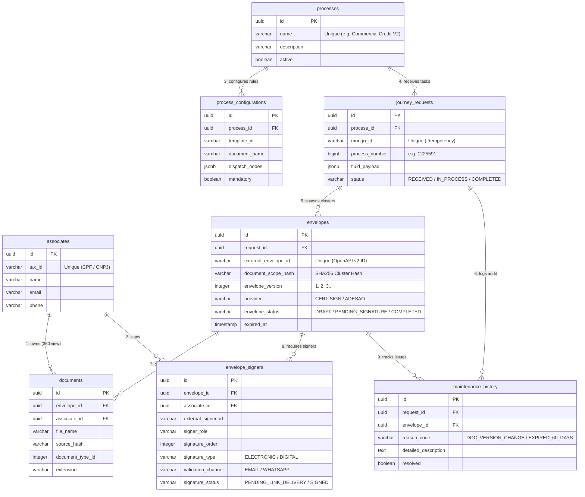

# Guia Visual de Relacionamentos do Banco de Dados (PostgreSQL)

**Documento Técnico Oficial de Arquitetura de Dados (PRODUÇÃO)**  
**Projeto:** DocJourney - Orquestrador de Assinaturas Eletrônicas e Gestão Documental  
**Estrutura Relacional:** 8 Tabelas em Inglês com chaves estrangeiras, índices e integridade referencial.

---

## 📊 1. Diagrama Entidade-Relacionamento (ERD)



---

## 🔗 2. Como as Tabelas se Relacionam na Prática

### A. Fluxo de Entrada e Idempotência
1. A esteira (Fluid) envia uma tarefa identificada por `mongo_id` e `process_number`.
2. A tabela `processes` garante que o tipo do processo existe ou é catalogado.
3. A tabela `journey_requests` registra a solicitação de forma idempotente: novas tentativas com o mesmo `mongo_id` não geram linhas duplicadas.

### B. Clusterização e Versionamento de Envelopes
1. Para cada combinação única de `[Documentos x Signatários]`, a automação gera um `document_scope_hash` determinístico via SHA256.
2. Na tabela `envelopes`, cada cluster gera um registro com `envelope_version = 1`.
3. Se o processo for reenviado com documentos alterados ou novos signatários, o envelope anterior recebe o status `REPLACED_CANCELED` e o novo envelope é criado com `envelope_version = versao_anterior + 1`.

### C. Cadastro Único do Associado (Visão 360)
1. O associado (`associates`) é único por CPF/CNPJ (`tax_id`).
2. Uma única pessoa pode participar de múltiplos envelopes e processos diferentes, mantendo histórico unificado de assinaturas e documentos.

---

## 🔍 3. Consultas SQL Rápidas para Auditoria Visual

```sql
-- Visão 360: Processo, Envelopes, Signatários e Documentos
SELECT 
    j.process_number,
    p.name AS process_name,
    e.envelope_version,
    e.envelope_status,
    e.external_envelope_id,
    a.name AS signer_name,
    es.signer_role,
    es.validation_channel,
    d.file_name
FROM journey_requests j
JOIN processes p ON p.id = j.process_id
JOIN envelopes e ON e.request_id = j.id
JOIN envelope_signers es ON es.envelope_id = e.id
JOIN associates a ON a.id = es.associate_id
JOIN documents d ON d.envelope_id = e.id
ORDER BY j.process_number, e.envelope_version;
```
