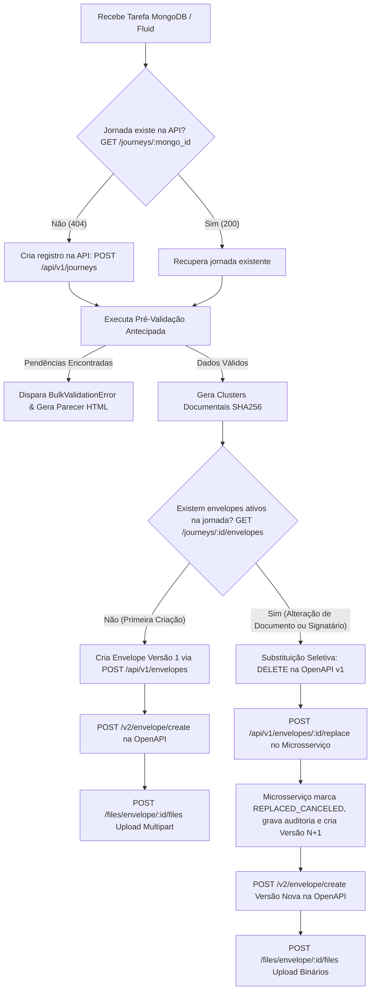

# Módulo de Automação RPA (DocJourney Automation)

Módulo orquestrador robótico projetado para execução no ambiente corporativo (Windows), responsável pela ingestão de tarefas do MongoDB (Fluid), pré-validação antecipada de documentos e signatários, clusterização de envelopes por escopo documental, upload multipart e substituição seletiva via OpenAPI v2.

---

## 🎯 1. Propósito e Arquitetura Desacoplada

A automação RPA é **100% desacoplada de conexões de banco de dados diretas (SQL/PostgreSQL)**:
- **Zero Acesso a Banco:** A automação não realiza `SELECT`, `INSERT`, nem executa DDLs no banco. Toda comunicação com a camada de persistência e governança é feita via chamadas HTTP RESTful para o **Microsserviço DocJourney**.
- **Client HTTP Resiliente (`MicroserviceApiClient`):** Comunicação baseada em HTTPX com sanitização automática de dados binários em payloads de metadados.
- **Fallback Automático para Modo Mock em Memória:** Caso a API do microsserviço esteja temporariamente inacessível ou em manutenção, o client ativa de forma transparente uma camada em memória para que o robô e os testes continuem funcionando sem falhas críticas.
- **Pré-Validação Antecipada ('Tudo de uma Vez'):** Varre simultaneamente todos os signatários, CPFs, canais de comunicação e integridade dos anexos. Não interrompe no primeiro erro (*No-Fail-Fast*), gerando um parecer HTML padronizado com todas as pendências para o operador do Fluid.
- **Clusterização Documental por SHA256:** Agrupa participantes pela interseção exata dos documentos que lhes cabe assinar, garantindo que nenhum envelope tenha signatários com escopos documentais divergentes.
- **Substituição Seletiva e Versionamento:** Cancelamento gracioso de versões obsoletas e emissão de novos envelopes incrementais quando há alterações no processo.

---

## 🧠 2. Ciclo Decisório da Automação

O ciclo decisório da automação comunica-se com a API do microsserviço conforme o fluxo abaixo:



### Regras de Negócio Decisórias:
1. **Identificação da Jornada:** A automação consulta `GET /api/v1/journeys/{mongo_id}`. Se for uma tarefa reencaminhada do Fluid após correção de parecer, o registro existente é reutilizado de forma idempotente.
2. **Cálculo do Hash de Escopo:** Para cada grupo de assinantes, calcula `document_scope_hash = SHA256(documentos_ordenados)`.
3. **Consulta de Envelopes Ativos:** Consulta `GET /api/v1/journeys/{id}/envelopes` filtrando envelopes ativos.
4. **Decisão de Criação vs Substituição:**
   - Se **nenhum envelope ativo existir**, é uma **Criação Inicial (Versão 1)**.
   - Se **já existirem envelopes ativos**, significa que o processo sofreu alterações (troca de arquivo PDF, inclusão de avalista/cônjuge ou retificação). A automação aciona `POST /api/v1/envelopes/{id}/replace`, que atomicamente marca a versão anterior como `REPLACED_CANCELED`, registra histórico de manutenção com justificativa e gera a nova versão ($v_{nova} = v_{antiga} + 1$).

---

## ⚙️ 3. Variáveis de Ambiente Necessárias

As configurações são lidas do arquivo `.env` ou das variáveis do sistema:

```env
# URL Base da API do Microsserviço Backend
MICROSERVICE_API_URL=http://localhost:8000

# Credenciais e URLs da OpenAPI de Assinatura Digital
OPENAPI_BASE_URL=https://api-assinatura.sicredi.local
OPENAPI_TOKEN=seu_token_aqui

# Ingestão MongoDB / Fluid
MONGO_URI=mongodb://localhost:27017
MONGO_DB=fluid_db
```

---

## 💻 4. Ambiente de Execução (Windows)

A automação foi desenhada para rodar com total estabilidade em máquinas virtuais e desktops Windows de RPA:
- **Encoding de Console:** Aplica `sys.stdout.reconfigure(encoding="utf-8")` automaticamente para evitar erros de caracteres especiais no PowerShell/CMD (`cp1252`).
- **Resiliência de Rede:** Timeout configurável e retries em chamadas HTTP contra a API do microsserviço e a OpenAPI.

---

## 🚀 5. Instruções de Execução e Testes

### Instalação de Dependências
```powershell
# Windows
.\.venv\Scripts\pip.exe install -r automacao/requirements.txt
```

### Execução dos Testes Unitários da Automação
Valida a pré-validação antecipada, o acúmulo de erros e a clusterização documental SHA256:
```powershell
.\.venv\Scripts\python.exe automacao/tests/run_tests.py
```

### Execução do Teste do Client HTTP da API com Mock Fallback
Valida que o robô opera perfeitamente mesmo sem a API física conectada:
```powershell
.\.venv\Scripts\python.exe -m unittest automacao/tests/test_automation_api_mock.py
```

### Execução da Bateria Interativa dos 6 Cenários de Negócio
Simula em tempo real todos os cenários operacionais da esteira de assinaturas:
1. Criação inicial com signatário único.
2. Versão incremental com alteração de PDF.
3. Inclusão de cônjuge/avalista com escopos segregados.
4. Acúmulo de múltiplos erros na pré-validação antecipada.
5. Varredura e expiração de envelopes pendentes vencidos.
6. Cancelamento administrativo via microsserviço.

```powershell
.\.venv\Scripts\python.exe automacao/tests/test_interactive_scenarios.py
```
