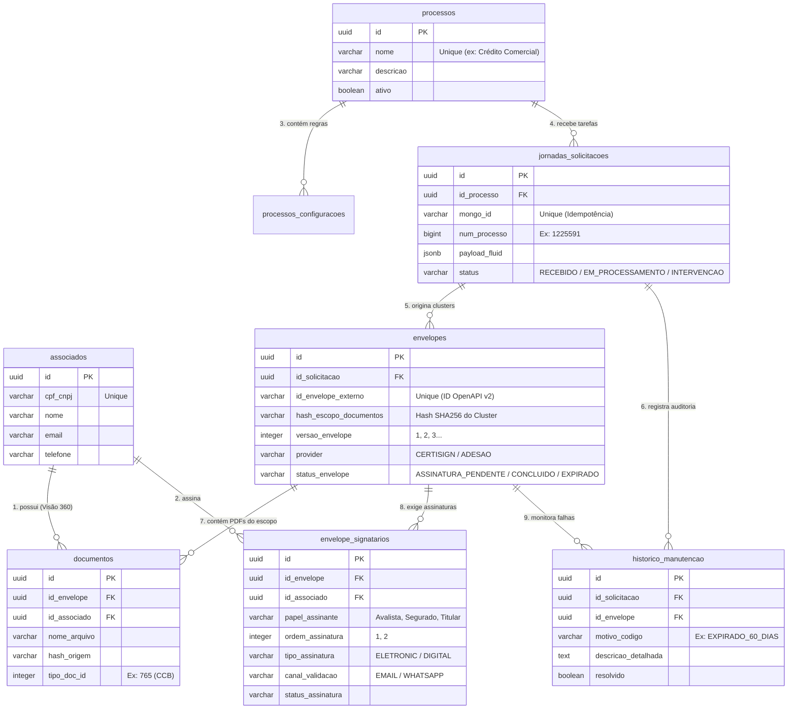

# Guia Visual de Relacionamentos do Banco de Dados (PostgreSQL)

Este documento foi criado para ajudar você a visualizar e analisar a estrutura relacional do banco de dados `docjourney_db`, mostrando como as 8 tabelas se conectam e como consultar os dados fictícios que populamos na sua máquina.

---

## 📊 1. Diagrama Entidade-Relacionamento (ERD)



---

## 🔍 2. Como as Tabelas se Conectam (Explicação Prática)

1. **`processos` $\rightarrow$ `jornadas_solicitacoes`**:
   - Um tipo de processo (ex.: *"Solicitação de Crédito Comercial V2"*) recebe várias tarefas/pedidos vindos do Fluid (`jornadas_solicitacoes`).
2. **`jornadas_solicitacoes` $\rightarrow$ `envelopes`**:
   - Uma solicitação do Fluid gera **um ou mais envelopes** dependendo da clusterização por escopo documental (`hash_escopo_documentos`).
3. **`envelopes` $\rightarrow$ `documentos` e `envelope_signatarios`**:
   - Cada envelope agrupa os arquivos binários PDFs daquele escopo (`documentos`) e os signatários que devem assiná-los (`envelope_signatarios`).
4. **`associados` (Visão 360 do Cliente)**:
   - A tabela `associados` centraliza a pessoa física ou jurídica por `cpf_cnpj`. Tanto a tabela `documentos` quanto `envelope_signatarios` apontam diretamente para `associados.id`, permitindo consultar rapidamente todos os documentos de um cliente.
5. **`historico_manutencao`**:
   - Registra log auditado de exceções, substituições e expirações de 60 dias vinculadas à solicitação e ao envelope impactado.

---

## 💻 3. Consultas SQL Prontas para Copiar e Colar

Você pode copiar e executar essas queries diretamente no pgAdmin, DBeaver ou VS Code PostgreSQL para visualizar os dados fictícios que populamos na sua máquina:

### 📄 Query 1: Visão Geral de Envelopes Clusterizados por Processo
> Mostra cada envelope gerado, seu status, qual o processo do Fluid e o hash de escopo documental:

```sql
SELECT 
    p.nome AS processo,
    j.num_processo,
    j.status AS status_jornada,
    e.id_envelope_externo,
    e.hash_escopo_documentos,
    e.versao_envelope,
    e.provider,
    e.status_envelope
FROM envelopes e
JOIN jornadas_solicitacoes j ON j.id = e.id_solicitacao
JOIN processos p ON p.id = j.id_processo
ORDER BY j.num_processo, e.versao_envelope;
```

---

### 👤 Query 2: Visão dos Signatários, Canais e Documentos por Envelope
> Exibe quem precisa assinar cada envelope, por qual canal (E-mail ou WhatsApp), qual o papel e qual arquivo PDF está associado:

```sql
SELECT 
    j.num_processo,
    e.id_envelope_externo,
    a.nome AS nome_signatario,
    a.cpf_cnpj,
    es.papel_assinante,
    es.canal_validacao,
    es.status_assinatura,
    d.nome_arquivo,
    d.tipo_doc_id
FROM envelope_signatarios es
JOIN associados a ON a.id = es.id_associado
JOIN envelopes e ON e.id = es.id_envelope
JOIN jornadas_solicitacoes j ON j.id = e.id_solicitacao
JOIN documentos d ON d.id_envelope = e.id
ORDER BY j.num_processo, es.ordem_assinatura;
```

---

### 🌐 Query 3: Visão 360 do Cliente (Consultar tudo de um CPF/CNPJ)
> Traz o histórico completo de um associado independentemente do processo:

```sql
SELECT 
    a.nome AS cliente,
    a.cpf_cnpj,
    p.nome AS processo,
    j.num_processo,
    es.papel_assinante,
    es.canal_validacao,
    d.nome_arquivo,
    e.status_envelope
FROM associados a
JOIN envelope_signatarios es ON es.id_associado = a.id
JOIN envelopes e ON e.id = es.id_envelope
JOIN jornadas_solicitacoes j ON j.id = e.id_solicitacao
JOIN processos p ON p.id = j.id_processo
JOIN documentos d ON d.id_envelope = e.id
WHERE a.cpf_cnpj = '02631353900';
```

---

### 🛠️ Query 4: Auditoria do Histórico de Manutenção e Intervenções
> Exibe os logs de envelopes expirados (> 60 dias) ou com erros que exigiram intervenção:

```sql
SELECT 
    j.num_processo,
    hm.motivo_codigo,
    hm.descricao_detalhada,
    hm.resolvido,
    hm.resolvido_por,
    hm.created_at AS data_ocorrencia
FROM historico_manutencao hm
JOIN jornadas_solicitacoes j ON j.id = hm.id_solicitacao
ORDER BY hm.created_at DESC;
```
