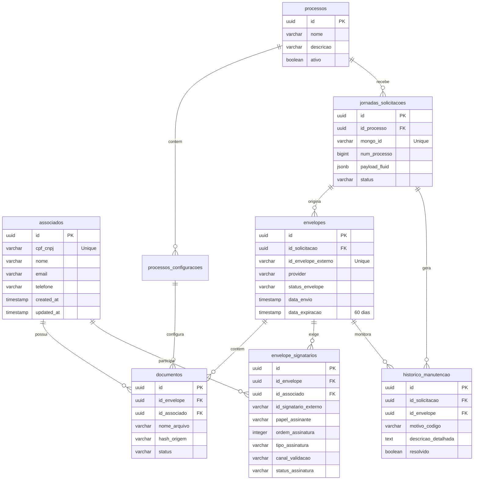

# Modelo Conceitual - Orquestrador de Assinaturas (OpenAPI v2)

```mermaid
erDiagram
    associados ||--o{ documentos : possui
    associados ||--o{ envelope_signatarios : participa
    processos ||--o{ processos_configuracoes : contem
    processos ||--o{ jornadas_solicitacoes : recebe
    processos_configuracoes ||--o{ documentos : configura
    jornadas_solicitacoes ||--o{ envelopes : origina
    jornadas_solicitacoes ||--o{ historico_manutencao : gera
    envelopes ||--o{ documentos : contem
    envelopes ||--o{ envelope_signatarios : exige
    envelopes ||--o{ historico_manutencao : monitora

    associados {
        uuid id PK
        varchar cpf_cnpj "Unique"
        varchar nome
        varchar email
        varchar telefone
        timestamp created_at
        timestamp updated_at
    }

    processos {
        uuid id PK
        varchar nome
        varchar descricao
        boolean ativo
    }

    jornadas_solicitacoes {
        uuid id PK
        uuid id_processo FK
        varchar mongo_id "Unique"
        bigint num_processo
        jsonb payload_fluid
        varchar status
    }

    envelopes {
        uuid id PK
        uuid id_solicitacao FK
        varchar id_envelope_externo "Unique"
        varchar provider
        varchar status_envelope
        timestamp data_envio
        timestamp data_expiracao "60 dias"
    }

    documentos {
        uuid id PK
        uuid id_envelope FK
        uuid id_associado FK
        varchar nome_arquivo
        varchar hash_origem
        varchar status
    }

    envelope_signatarios {
        uuid id PK
        uuid id_envelope FK
        uuid id_associado FK
        varchar id_signatario_externo
        varchar papel_assinante
        integer ordem_assinatura
        varchar tipo_assinatura
        varchar canal_validacao
        varchar status_assinatura
    }

    historico_manutencao {
        uuid id PK
        uuid id_solicitacao FK
        uuid id_envelope FK
        varchar motivo_codigo
        text descricao_detalhada
        boolean resolvido
    }
```

